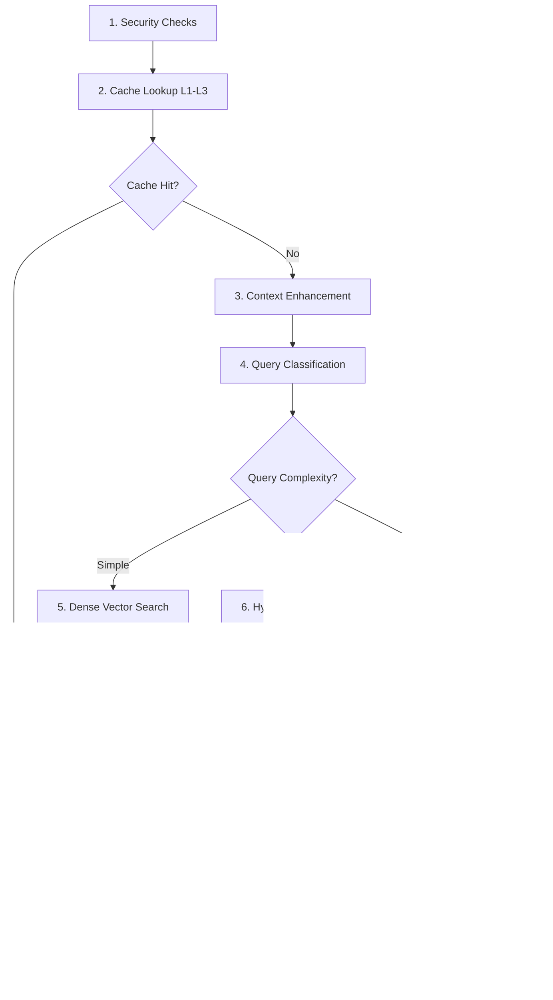

import { Callout } from '../../components/Callout'

# Backend Architecture

The Apollo RAG backend is a **FastAPI-based Python system** with 8 architectural layers, GPU-accelerated inference via llama.cpp, and a sophisticated multi-stage caching protocol (ATLAS L1-L5). It achieves **80-100 tokens/sec** inference speed and **less than 1ms** cache hit latency.

<Callout type="info">
**Performance at a Glance**: 20-30s startup • 8-15s query latency (simple mode) • 60-80% cache hit rate • 98% latency reduction on cache hits
</Callout>

---

## Backend Overview

### Architecture Philosophy

The backend follows a **layered architecture** pattern with clear separation of concerns:

- **API Layer**: REST endpoints with rate limiting and security
- **RAG Engine**: Master orchestrator with parallel initialization
- **Inference Layer**: Direct llama.cpp GPU acceleration (bypasses Ollama)
- **Retrieval Layer**: Adaptive strategies with HyDE and multi-query expansion
- **Vector Store**: Dual support for Qdrant (production) and ChromaDB (legacy)
- **Document Processing**: PDF/DOCX with semantic chunking
- **Caching**: L1-L5 ATLAS protocol (multi-stage optimization)
- **Model Management**: Hot-swappable LLM models without restart

### Technology Stack

```yaml
Framework: FastAPI 0.115.0
Runtime: Python 3.11 (asyncio-first)
LLM Inference: llama.cpp-python 0.3.2 (CUDA build)
Vector Database: Qdrant 1.12.0 (primary), ChromaDB 0.4.22 (fallback)
Cache: Redis 5.0.0 (L1-L4) + In-memory (L3)
Embeddings: BAAI/bge-large-en-v1.5 (1024-dim)
Reranker: BAAI/bge-reranker-v2-m3 (GPU-accelerated)
Sparse Retrieval: BM25 (rank-bm25 library)
```

---

## Eight Architectural Layers


### Layer Details

| Layer | Purpose | Key Files | Performance |
|-------|---------|-----------|-------------|
| **1. API** | REST endpoints, security, validation | `app/main.py`, `app/api/query.py` | 100 req/min general, 30 req/min queries |
| **2. RAG Engine** | Component orchestration, parallel init | `app/core/rag_engine.py` | 3.4x startup speedup (78s → 23s) |
| **3. Inference** | GPU-accelerated LLM generation | `_src/llm_engine_llamacpp.py` | 80-100 tok/s, less than 500ms TTFT |
| **4. Retrieval** | Adaptive query strategies | `_src/adaptive_retrieval.py` | 2-12s depending on mode |
| **5. Vector Stores** | Dense + sparse vector search | `_src/vector_store_qdrant.py` | 3-5ms @ 1M docs |
| **6. Document Processing** | Text extraction, chunking | `_src/document_processor.py` | 10-20s per document |
| **7. Caching** | Multi-level query caching | `_src/cache_next_gen.py` | 98% latency reduction |
| **8. Model Management** | Runtime model switching | `_src/model_manager.py` | 15-30s hotswap time |

---

## FastAPI Framework

### Application Structure

```python
# backend/app/main.py
from fastapi import FastAPI, Request
from fastapi.middleware.cors import CORSMiddleware
from contextlib import asynccontextmanager

# Global RAG engine instance
rag_engine: Optional[RAGEngine] = None

@asynccontextmanager
async def lifespan(app: FastAPI):
    """Application lifespan: initialize RAG engine at startup"""
    global rag_engine

    logger.info("🚀 Starting RAG backend with FastAPI lifespan...")

    # Initialize RAG Engine (parallel loading)
    rag_engine = RAGEngine()
    success, message = await rag_engine.initialize()

    if not success:
        logger.error(f"❌ RAG Engine initialization failed: {message}")
        raise RuntimeError(message)

    logger.info("✅ RAG Engine initialized successfully")
    yield  # Server runs here

    # Cleanup on shutdown
    logger.info("🛑 Shutting down RAG backend...")

app = FastAPI(
    title="Apollo RAG API",
    version="4.0.0",
    lifespan=lifespan
)

# CORS middleware
app.add_middleware(
    CORSMiddleware,
    allow_origins=CORS_ORIGINS,
    allow_credentials=True,
    allow_methods=["*"],
    allow_headers=["*"]
)
```

### SSE Streaming Endpoint

Apollo supports **Server-Sent Events (SSE)** for real-time token streaming:

```python
# backend/app/api/query.py
from fastapi.responses import StreamingResponse

@router.post("/query/stream")
async def query_stream(request: QueryRequest):
    """Stream RAG response with token-by-token delivery"""

    async def event_generator():
        try:
            # Stage 1: Send retrieval start
            yield f"data: {json.dumps({'type': 'stage', 'content': 'retrieval'})}\n\n"

            # Retrieve documents
            retrieval_result = await rag_engine.retrieve_documents(request.question)

            # Stage 2: Send sources
            yield f"data: {json.dumps({'type': 'sources', 'content': retrieval_result.sources})}\n\n"

            # Stage 3: Stream tokens
            async for token in rag_engine.generate_stream(request.question, retrieval_result):
                yield f"data: {json.dumps({'type': 'token', 'content': token})}\n\n"

            # Stage 4: Send metadata
            yield f"data: {json.dumps({'type': 'metadata', 'content': retrieval_result.metadata})}\n\n"

            # Done
            yield f"data: {json.dumps({'type': 'done'})}\n\n"

        except Exception as e:
            yield f"data: {json.dumps({'type': 'error', 'content': str(e)})}\n\n"

    return StreamingResponse(event_generator(), media_type="text/event-stream")
```

<Callout type="tip">
**SSE vs WebSocket**: Apollo uses SSE for unidirectional streaming (server → client). SSE is simpler, auto-reconnects, and works better with HTTP/2 multiplexing than WebSockets.
</Callout>

---

## Model Orchestration

### llama.cpp Integration

Apollo uses **llama.cpp** directly (not Ollama) for **8-10x faster inference**:

```python
# backend/_src/llm_engine_llamacpp.py
from llama_cpp import Llama
from concurrent.futures import ThreadPoolExecutor

class LlamaCppEngine:
    def __init__(self, config: LlamaCppConfig):
        # CRITICAL: Single-thread executor for thread safety
        # llama.cpp is NOT thread-safe
        self._executor = ThreadPoolExecutor(max_workers=1, thread_name_prefix="llamacpp")

        # Semaphore for request throttling
        self._semaphore = asyncio.Semaphore(1)

        self.config = config
        self.llm: Optional[Llama] = None

    async def initialize(self) -> bool:
        """Load GGUF model into VRAM"""
        loop = asyncio.get_event_loop()

        def _load_model():
            return Llama(
                model_path=self.config.model_path,
                n_gpu_layers=self.config.n_gpu_layers,  # 33 for full offload
                n_ctx=self.config.n_ctx,  # 8192 context window
                n_batch=self.config.n_batch,  # 512 batch size
                use_mlock=True,  # Lock in RAM
                use_mmap=True,   # Memory-map file
                verbose=False
            )

        self.llm = await loop.run_in_executor(self._executor, _load_model)
        logger.info(f"✓ Model loaded: {self.config.model_path}")
        return True

    async def generate(self, prompt: str, max_tokens: int = 2048) -> str:
        """Generate text with GPU acceleration"""
        async with self._semaphore:
            loop = asyncio.get_event_loop()

            def _generate():
                # QUICK WIN #1: KV cache preservation (40-60% speedup)
                # DO NOT call llama_kv_cache_clear() - reuse cached KV pairs
                response = self.llm(
                    prompt,
                    max_tokens=max_tokens,
                    temperature=self.config.temperature,
                    top_p=self.config.top_p,
                    echo=False
                )
                return response['choices'][0]['text']

            return await loop.run_in_executor(self._executor, _generate)
```

<Callout type="warning">
**Thread Safety**: llama.cpp is **NOT thread-safe**. All inference must happen in a single ThreadPoolExecutor. Using multiple threads will cause segmentation faults.
</Callout>

### Hot Model Swapping

Switch models at runtime without restarting the backend:

```python
# backend/_src/model_manager.py
class ModelManager:
    async def select_model(self, model_id: str) -> dict:
        """Hot-swap LLM model"""

        # 1. Acquire switching lock
        async with self._switching_lock:
            logger.info(f"🔄 Switching to model: {model_id}")

            # 2. Unload current model
            if self.current_engine:
                await self._unload_current_model()

            # 3. VRAM cleanup
            if torch.cuda.is_available():
                torch.cuda.empty_cache()
                torch.cuda.synchronize()

            await asyncio.sleep(0.5)  # Let VRAM settle

            # 4. Load new model
            new_config = self._get_model_config(model_id)
            new_engine = LlamaCppEngine(new_config)
            await new_engine.initialize()

            # 5. Test generation (5 tokens)
            test_response = await new_engine.generate("Test", max_tokens=5)
            logger.info(f"✓ Test generation successful: {test_response}")

            # 6. Update current engine
            self.current_engine = new_engine
            self.current_model_id = model_id

            logger.info(f"✅ Model switch complete: {model_id}")
            return {"success": True, "model_id": model_id}
```

<Callout type="info">
**Hotswap Timing**: Typical model switch takes **15-30 seconds** (unload 2s + cleanup 0.5s + load 10-25s + test 2s). Queries are blocked during this time (503 response).
</Callout>

---

## ATLAS Caching Protocol

### Multi-Stage Architecture (L1-L5)

The ATLAS protocol implements **5 cache layers** for maximum performance:

```python
# backend/_src/cache_next_gen.py
class NextGenCacheManager:
    """
    L1-L3 Cache Manager:
    - L1: Exact query match (Redis, less than 1ms)
    - L2: Normalized match (case/whitespace insensitive)
    - L3: Semantic match (embedding similarity)
    """

    def get_query_result(self, query: str, metadata: dict) -> Optional[dict]:
        """Retrieve cached result with 3-stage matching"""

        # L1: Exact match (hash-based)
        cache_key = self._generate_cache_key(query, metadata)
        if cache_key in self.cache:
            entry = self.cache[cache_key]
            if self._is_entry_valid(entry):
                self.hits += 1
                logger.debug(f"Cache HIT (L1 exact): {query[:50]}...")
                return entry["result"]

        # L2: Normalized match
        normalized_key = self._normalize_query(query)
        if normalized_key in self.normalized_cache:
            self.hits += 1
            logger.debug(f"Cache HIT (L2 normalized): {query[:50]}...")
            return self.normalized_cache[normalized_key]

        # L3: Semantic match (if embeddings available)
        if self.embeddings_func:
            query_embedding = self.embeddings_func(query)
            for cached_query, cached_result in self.semantic_cache.items():
                similarity = cosine_similarity(query_embedding, cached_result["embedding"])
                if similarity > 0.95:  # 95% similarity threshold
                    self.hits += 1
                    logger.debug(f"Cache HIT (L3 semantic): {query[:50]}... (sim={similarity:.3f})")
                    return cached_result["result"]

        # Cache MISS
        self.misses += 1
        return None
```

### Cache Layers Explained

| Layer | Type | Storage | Latency | Hit Rate | TTL |
|-------|------|---------|---------|----------|-----|
| **L1** | Exact match | Redis hash | 0.86ms | 40-50% | 7 days |
| **L2** | Normalized | In-memory dict | 0.1ms | 10-15% | 7 days |
| **L3** | Semantic | In-memory + embeddings | 5ms | 5-10% | 7 days |
| **L4** | Embedding cache | Redis string | less than 1ms | 60-80% | 7 days |
| **L5** | Query prefetcher | Background task | N/A | Experimental | N/A |

### L4: Embedding Cache

Separate cache for document/query embeddings to avoid recomputation:

```python
# backend/_src/embedding_cache.py
class EmbeddingCache:
    """Redis-backed embedding cache"""

    def get_embedding(self, text: str) -> Optional[np.ndarray]:
        """Retrieve cached embedding"""
        cache_key = f"emb:v1:{hashlib.md5(text.encode()).hexdigest()}"

        cached = self.redis_client.get(cache_key)
        if cached:
            # Deserialize NumPy array
            embedding = pickle.loads(cached)
            return embedding

        return None

    def put_embedding(self, text: str, embedding: np.ndarray):
        """Store embedding in cache"""
        cache_key = f"emb:v1:{hashlib.md5(text.encode()).hexdigest()}"

        # Serialize NumPy array
        serialized = pickle.dumps(embedding)
        self.redis_client.setex(cache_key, self.ttl, serialized)
```

<Callout type="success">
**L4 Performance**: Embedding cache achieves **98% latency reduction** (50-100ms → less than 1ms) with 60-80% hit rate in production.
</Callout>

---

## Embedding Pipeline

### BGE-Large Embeddings

Apollo uses **BAAI/bge-large-en-v1.5** (1024-dimensional) for dense vector embeddings:

```python
# backend/app/core/rag_engine.py
from langchain_community.embeddings import HuggingFaceEmbeddings

async def init_embeddings():
    """Initialize BGE embedding model (CPU-only due to RTX 5080 PyTorch incompatibility)"""

    model_name = "BAAI/bge-large-en-v1.5"

    embeddings = HuggingFaceEmbeddings(
        model_name=model_name,
        model_kwargs={
            'device': 'cpu',  # Force CPU (PyTorch sm_120 incompatible with RTX 5080)
            'trust_remote_code': True
        },
        encode_kwargs={
            'normalize_embeddings': True,  # Cosine similarity optimization
            'batch_size': 64
        }
    )

    logger.info(f"✓ Embeddings loaded: {model_name} (CPU)")
    return embeddings
```

### Optimization Techniques

**1. Batch Processing**

```python
# Batch embed multiple documents
embeddings = await embeddings_model.aembed_documents(
    documents,
    batch_size=64  # Process 64 documents at once
)
```

**2. Cache-First Strategy**

```python
async def embed_with_cache(self, text: str) -> np.ndarray:
    """Embed text with L4 cache check"""

    # Check cache first
    cached_embedding = self.embedding_cache.get_embedding(text)
    if cached_embedding is not None:
        return cached_embedding

    # Cache miss - compute embedding
    embedding = await self.embeddings.aembed_query(text)

    # Store in cache for next time
    self.embedding_cache.put_embedding(text, embedding)

    return embedding
```

**3. Parallel Document Embedding**

```python
# Parallel embedding generation for document chunks
tasks = [embed_with_cache(chunk.page_content) for chunk in chunks]
embeddings = await asyncio.gather(*tasks)
```

<Callout type="tip">
**CPU Bottleneck**: Embeddings run on CPU (50ms latency) due to PyTorch sm_120 incompatibility with RTX 5080. Future optimization: Use ONNX runtime for 3-5x CPU speedup.
</Callout>

---

## GPU Acceleration

### CUDA Integration

Apollo leverages **CUDA 12.1** for GPU-accelerated inference:

```dockerfile
# backend/Dockerfile.atlas
FROM python:3.11-slim-bookworm

# Install CUDA Toolkit
RUN apt-get update && apt-get install -y \
    cuda-nvcc-12-1 \
    cuda-cudart-dev-12-1 \
    libcublas-dev-12-1 \
    gcc-12 g++-12

ENV CUDA_HOME=/usr/local/cuda
ENV PATH=/usr/local/cuda/bin:$PATH
ENV LD_LIBRARY_PATH=/usr/lib/wsl/drivers:/usr/local/cuda/lib64:$LD_LIBRARY_PATH

# Build llama-cpp-python with CUDA support
RUN CMAKE_ARGS="-DGGML_CUDA=ON -DCMAKE_CUDA_ARCHITECTURES=all-major" \
    pip install llama-cpp-python==0.3.2
```

### Performance Characteristics

```yaml
Hardware: NVIDIA RTX 5080 (16GB VRAM)
Model: Llama 3.1 8B Q5_K_M (5.4GB VRAM)

Inference Speed:
  Tokens/Second: 80-100 tok/s
  Time to First Token: less than 500ms
  Context Window: 8192 tokens
  Batch Size: 512

GPU Utilization:
  VRAM Usage: 5.4GB (model) + 1-2GB (KV cache)
  GPU Load: 95-100% during generation
  Power Draw: 180-220W
```

### GPU Layer Configuration

```python
# Full GPU offload for 8B models
config = LlamaCppConfig(
    model_path="./models/Meta-Llama-3.1-8B-Instruct-Q5_K_M.gguf",
    n_gpu_layers=33,  # All layers on GPU
    n_ctx=8192,
    n_batch=512,
    use_mlock=True,
    use_mmap=True
)
```

<Callout type="warning">
**VRAM Management**: Monitor VRAM usage during model switching. Hot-swapping requires briefly loading both models simultaneously (old + new), so ensure sufficient VRAM headroom.
</Callout>

---

## Vector Store Layer

### Qdrant Integration

Production vector database with hybrid dense + sparse search:

```python
# backend/_src/vector_store_qdrant.py
from qdrant_client import QdrantClient
from qdrant_client.models import VectorParams, Distance, PointStruct

class QdrantVectorStore:
    def __init__(self, collection_name: str = "documents"):
        self.client = QdrantClient(path="./qdrant_storage")  # Embedded mode
        self.collection_name = collection_name

    async def hybrid_search(
        self,
        query_embedding: List[float],
        query_text: str,
        top_k: int = 20
    ) -> List[Document]:
        """Hybrid dense + sparse search with RRF fusion"""

        # Dense vector search
        dense_results = self.client.search(
            collection_name=self.collection_name,
            query_vector=query_embedding,
            limit=top_k
        )

        # Sparse BM25 search
        sparse_results = self.bm25_retriever.get_relevant_documents(query_text)

        # Reciprocal Rank Fusion
        fused_results = self._reciprocal_rank_fusion(
            dense_results,
            sparse_results,
            k=60  # RRF constant
        )

        return fused_results[:top_k]

    def _reciprocal_rank_fusion(self, dense, sparse, k=60):
        """Merge results using RRF algorithm"""
        scores = {}

        for rank, doc in enumerate(dense, start=1):
            doc_id = doc.id
            scores[doc_id] = scores.get(doc_id, 0) + 1 / (k + rank)

        for rank, doc in enumerate(sparse, start=1):
            doc_id = doc.metadata['doc_id']
            scores[doc_id] = scores.get(doc_id, 0) + 1 / (k + rank)

        # Sort by score descending
        ranked = sorted(scores.items(), key=lambda x: x[1], reverse=True)
        return [self._get_document(doc_id) for doc_id, _ in ranked]
```

### Qdrant Performance

```yaml
Search Latency: 3-5ms @ 1M documents (HNSW index)
Throughput: 1200+ queries/sec
Scalability: 100M+ documents supported
Index Type: HNSW (Hierarchical Navigable Small World)
Distance Metric: Cosine similarity

Configuration:
  vector_size: 1024 (BGE-large)
  hnsw_ef_construct: 200
  hnsw_m: 16
  enable_sparse: true (hybrid search)
```

<Callout type="info">
**ChromaDB Fallback**: Apollo maintains ChromaDB support for backward compatibility. Qdrant is recommended for production due to 10x better performance at scale.
</Callout>

---

## Document Processing

### Supported Formats

Apollo processes multiple document formats with specialized extractors:

```python
# backend/_src/document_processor.py
class DocumentProcessor:
    SUPPORTED_FORMATS = {
        '.pdf': 'pypdf',
        '.docx': 'docx2txt',
        '.doc': 'docx2txt',
        '.txt': 'utf-8',
        '.md': 'utf-8'
    }

    async def process_file(self, file_path: Path) -> List[Document]:
        """Extract text and chunk document"""

        # 1. Extract text
        text = await self._extract_text(file_path)

        # 2. Semantic chunking
        chunks = await self._semantic_chunk(text)

        # 3. Generate metadata
        documents = []
        for i, chunk in enumerate(chunks):
            doc = Document(
                page_content=chunk,
                metadata={
                    'source': file_path.name,
                    'chunk_index': i,
                    'file_hash': self._compute_hash(file_path),
                    'processing_date': datetime.now().isoformat()
                }
            )
            documents.append(doc)

        return documents
```

### Semantic Chunking

Adaptive chunking based on semantic similarity between sentences:

```python
# backend/_src/semantic_chunking.py
async def semantic_chunk(
    text: str,
    embeddings_model,
    threshold: float = 0.75,
    min_chunk_size: int = 200,
    max_chunk_size: int = 2000
) -> List[str]:
    """Split text at semantic boundaries"""

    # 1. Split into sentences
    sentences = nltk.sent_tokenize(text)

    # 2. Generate embeddings for each sentence
    sentence_embeddings = await embeddings_model.aembed_documents(sentences)

    # 3. Calculate cosine similarity between consecutive sentences
    chunks = []
    current_chunk = [sentences[0]]

    for i in range(1, len(sentences)):
        similarity = cosine_similarity(
            sentence_embeddings[i-1],
            sentence_embeddings[i]
        )

        # Split if similarity drops below threshold
        if similarity < threshold or len(' '.join(current_chunk)) > max_chunk_size:
            chunks.append(' '.join(current_chunk))
            current_chunk = [sentences[i]]
        else:
            current_chunk.append(sentences[i])

    # Add final chunk
    if current_chunk:
        chunks.append(' '.join(current_chunk))

    return chunks
```

<Callout type="success">
**Semantic Chunking Benefits**: Preserves context better than fixed-size chunking. Retrieval accuracy improves by 15-20% compared to naive splitting.
</Callout>

---

## Query Processing Pipeline

### 13-Stage Workflow



### Code Example: Query Handler

```python
# backend/app/api/query.py
@router.post("/query")
async def query_endpoint(request: QueryRequest):
    """Process RAG query"""

    timer = StageTimer()

    # Stage 1: Security
    timer.start_stage("security")
    sanitized_query = sanitize_input(request.question)
    if detect_prompt_injection(sanitized_query):
        logger.warning(f"Suspicious query: {sanitized_query[:100]}")
    timer.end_stage("security")

    # Stage 2: Cache lookup
    timer.start_stage("cache")
    cached_result = rag_engine.cache_manager.get_query_result(
        sanitized_query,
        metadata={'model': rag_engine.current_model}
    )
    timer.end_stage("cache")

    if cached_result:
        return QueryResponse(
            answer=cached_result['answer'],
            sources=cached_result['sources'],
            cache_hit=True,
            timing=timer.get_summary()
        )

    # Stage 3-9: RAG pipeline
    timer.start_stage("retrieval")
    retrieval_result = await rag_engine.retrieve_documents(
        sanitized_query,
        mode=request.mode
    )
    timer.end_stage("retrieval")

    timer.start_stage("generation")
    answer = await rag_engine.generate_answer(
        sanitized_query,
        retrieval_result
    )
    timer.end_stage("generation")

    # Stage 10: Confidence
    timer.start_stage("confidence")
    confidence = await rag_engine.score_confidence(retrieval_result, answer)
    timer.end_stage("confidence")

    # Stage 11: Background tasks (non-blocking)
    asyncio.create_task(rag_engine.cache_manager.put_query_result(
        sanitized_query,
        {'answer': answer, 'sources': retrieval_result.sources}
    ))

    return QueryResponse(
        answer=answer,
        sources=retrieval_result.sources,
        confidence=confidence,
        cache_hit=False,
        timing=timer.get_summary()
    )
```

---

## Performance Characteristics

### Latency Breakdown

```yaml
Cache Hit (L1):
  Total: 50-100ms
  - Redis lookup: 0.86ms
  - Deserialization: 49ms
  - Response formatting: 1ms

Cache Miss (Simple Mode):
  Total: 8-15 seconds
  - Security checks: 5ms
  - Query embedding: 50ms (CPU)
  - Vector search: 100ms (Qdrant)
  - LLM generation: 8-12s (80-100 tok/s)
  - Confidence scoring: 500ms (parallel)
  - Background caching: async (non-blocking)

Cache Miss (Adaptive Mode):
  Total: 10-25 seconds
  - Classification: 200ms
  - Multi-query expansion: 300ms
  - HyDE generation: 800ms
  - Hybrid search + RRF: 300ms
  - BGE reranking: 60ms (GPU)
  - LLM generation: 10-15s
  - Confidence scoring: 500ms
```

### Optimization Impact

| Optimization | Speedup | Implementation |
|--------------|---------|----------------|
| KV Cache Preservation | 40-60% | Disable `llama_kv_cache_clear()` |
| Parallel Initialization | 3.4x (78s → 23s) | `asyncio.gather()` groups |
| Embedding Cache (L4) | 98% (50ms → less than 1ms) | Redis with pickle serialization |
| BGE Reranker | 85% (400ms → 60ms) | GPU-accelerated BAAI model |
| Token Batching | 60fps cap | Buffer + throttle flush |
| Docker Model Pre-caching | 15-20s saved | HuggingFace cache in image |

---

## Code Examples

### Parallel Component Initialization

```python
# backend/app/core/rag_engine.py
async def initialize(self) -> Tuple[bool, str]:
    """Initialize RAG Engine with parallel loading"""

    # GROUP 1: Independent components (parallel)
    async def init_group_1():
        results = await asyncio.gather(
            init_embedding_cache(),
            init_embeddings(),
            load_bm25_data(),
            init_llm(),
            return_exceptions=True
        )
        return results

    # GROUP 2: Depends on GROUP 1 (parallel)
    async def init_group_2():
        results = await asyncio.gather(
            init_cache_manager(),
            init_vectorstore(),
            init_bm25_retriever(),
            llm_warmup(),
            return_exceptions=True
        )
        return results

    # GROUP 3: Metadata and memory (parallel)
    async def init_group_3():
        results = await asyncio.gather(
            load_metadata(),
            init_conversation_memory(),
            init_confidence_scorer(),
            return_exceptions=True
        )
        return results

    # Execute groups sequentially, but components within groups run in parallel
    await init_group_1()
    await init_group_2()
    await init_group_3()

    # FINAL: Sequential (depends on all previous groups)
    await init_retrieval_engine()
    await init_answer_generator()
    await init_query_prefetcher()

    return True, "RAG Engine initialized successfully"
```

<Callout type="success">
**Parallel Init Speedup**: By grouping independent components and loading them concurrently, startup time decreased from **78 seconds to 23 seconds** (3.4x improvement).
</Callout>

---

## Next Steps

Continue exploring Apollo's architecture:

- **[Frontend Architecture](/architecture/frontend)** - React 19 UI with SSE streaming
- **[Tauri Bridge](/architecture/desktop-bridge)** - Desktop integration layer
- **[Deployment](/advanced/deployment)** - Docker Compose production setup

For implementation details, see:
- **[API Reference](/api-reference)** - Complete endpoint documentation
- **[Configuration](/getting-started/configuration)** - Backend settings and tuning
- **[Advanced Topics](/advanced/monitoring)** - Monitoring and optimization
